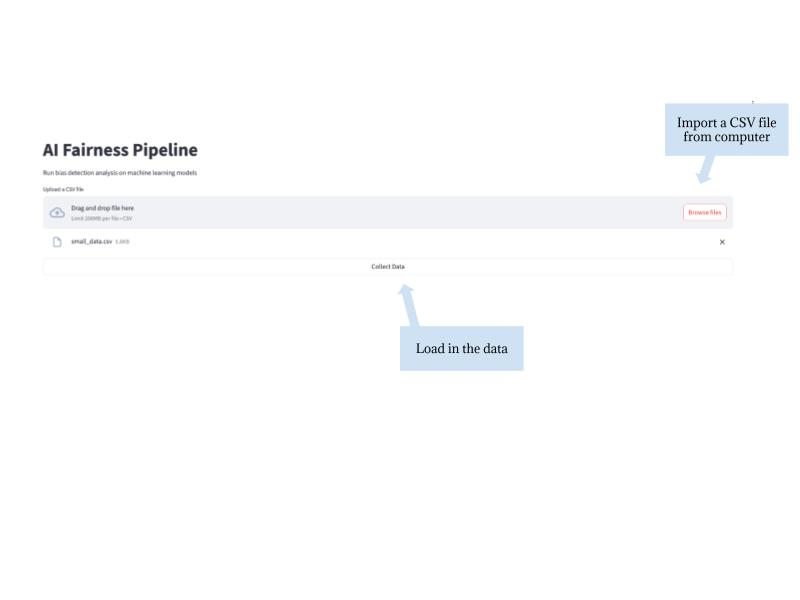
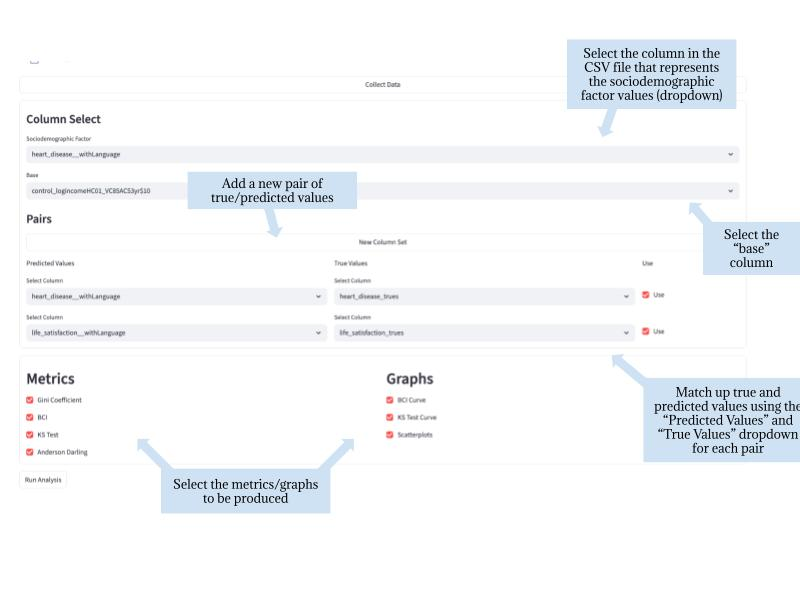
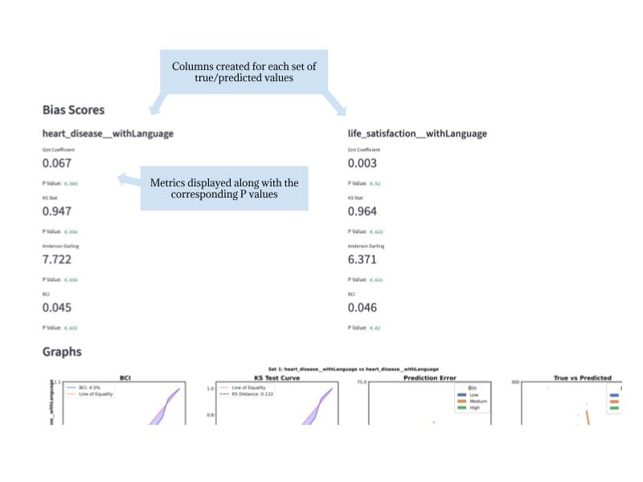
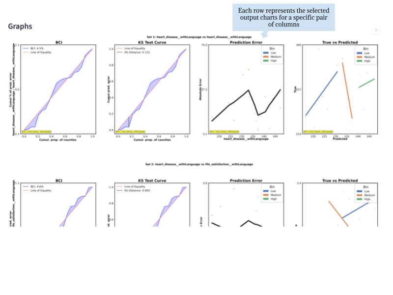

# AI Fairness Pipeline

A web application and research toolkit for measuring **sociodemographic error disparities** in machine learning models, based on the paper *"Quantifying Error Disparities in Population Health Models"*.

## Live App

The web app is hosted on Streamlit Community Cloud and allows users to upload their own CSV data and run bias detection analysis without any coding.
https://humanlanguage.org/BCI

## Background

Most AI fairness research evaluates disparities at the individual or document level using discrete demographic categories. This project introduces the **Bilateral Concentration Index (BCI)** — a metric inspired by the Gini coefficient and Concentration Curves — to quantify nonmonotonic error disparities in community-level prediction tasks where sociodemographic attributes are continuous rather than categorical.

The BCI captures disparity magnitude regardless of direction, detecting non-linear relationships between prediction error and sociodemographic rank that are missed by standard metrics like KS statistic or Concentration Index.

The paper applies this toolkit to audit sociodemographic error disparities in lexical- and transformer-based models predicting U.S. county-level health outcomes (heart disease, life satisfaction, fair/poor health, suicide mortality) across three demographic factors (income, education, foreign-born population).

---

## Repository Structure

```
AiFairnessPipeline/
├── app.py                          # Streamlit web application
├── requirements.txt                # Python dependencies
├── src/
│   ├── ParsePredictionsByDem.py    # Core analysis and metrics engine
│   └── RegAndClassTests.py         # Regression/classification test classes (research use)
├── features/
│   └── runTests.py                 # Script to run research experiments
└── static/
    ├── static_img_bilateral_concentration_curve.png
    ├── static_img_BCI_formula.png
    └── static_img_fx_formula.png
```

---

## File Descriptions

### `app.py`
The Streamlit web interface. Users can:
- Upload a CSV file with prediction data
- Select columns for predicted values, true values, error, and a sociodemographic factor
- Choose which bias metrics and graphs to compute
- Download sample data to test the tool

### `src/ParsePredictionsByDem.py`
The core analysis engine. Contains:
- **`iterateOverData()`** — main function that computes all bias metrics and generates graphs
- **BCI** (`npConcentrationCoefficientIntegrate`) — the Bilateral Concentration Index
- **KS Test** — Kolmogorov-Smirnov statistic
- **Gini Coefficient** — discrete Gini coefficient
- **Anderson-Darling** — weighted tail-sensitive disparity metric
- **Bootstrap resampling** — for significance testing against null/alternative distributions
- **Plot functions** — BCI curve, KS curve, scatterplots (error vs. demographic, true vs. predicted)

### `src/RegAndClassTests.py`
Research-facing classes for running regression and classification experiments using the DLATK framework against a database backend. Used in the original paper's large-scale audit. Not used by the web app.

### `features/runTests.py`
Script to reproduce the paper's experiments (DS4UD and CTLB datasets). Requires database access and DLATK setup. Not used by the web app.

---

## Web App Usage

### Input Format
Upload a CSV with a header row. You will need columns for:
- **Predicted values** — your model's predictions
- **True values** — the ground truth labels
- **Sociodemographic factor** — a continuous demographic variable (e.g. % with high school diploma, median income)
- **Baseline** *(optional)* — a comparison model's predictions for significance testing

A sample dataset is available to download directly from the app.

### Metrics Computed
| Metric | Description |
|--------|-------------|
| **BCI** | Bilateral Concentration Index — primary disparity metric, captures nonlinear relationships |
| **Gini Coefficient** | Measures inequality of error distribution |
| **KS Statistic** | Maximum deviation between error curve and line of equality |
| **Anderson-Darling** | Tail-weighted disparity measure |

All metrics include bootstrap p-values when a baseline comparison model is provided.

### Graphs
- **BCI Curve** — concentration curve vs. line of equality
- **KS Curve** — KS distance visualization
- **Scatterplots** — prediction error and true vs. predicted values colored by demographic tercile

---

## How to Use

### Step 1: Load Data File


Upload your CSV file using the file uploader. You can also click **Download Sample Data** to get a sample dataset to try the tool with.

### Step 2: Select & Tag Columns and Configure Output Formats


Select which columns in your CSV correspond to predicted values, true values, and the sociodemographic factor. Optionally select a baseline column for significance testing. Choose which metrics and graphs to compute.

### Step 3: View Output (Metrics)


After clicking **Run Analysis**, bias scores are displayed in a table. Each metric is shown alongside its bootstrap p-value when a baseline is provided.

### Step 4: View Output (Graphs)


Visualizations are displayed below the metrics table, including the BCI concentration curve, KS test curve, and scatterplots of error and true vs. predicted values colored by demographic tercile.

---

## Installation (Local)

```bash
git clone https://github.com/AaronMarker/AiFairnessPipeline.git
cd AiFairnessPipeline
pip install -r requirements.txt
streamlit run app.py
```

### Dependencies
```
streamlit
pandas
numpy==1.26.4
scipy
matplotlib
seaborn
scikit-learn
pillow
requests
statsmodels
patsy
```

---

## Citation

If you use this tool or the BCI metric in your work, please cite:

```
@article{aifairnesspipeline,
  title={Bilateral Concentration Index: Measuring Error Disparities in Community-Level Health Prediction},
  author={...},
  year={2024}
}
```

---

## License

For research and non-commercial use.
